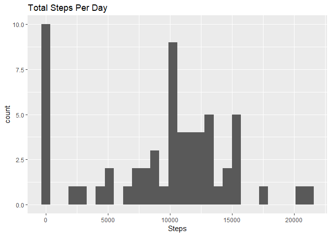
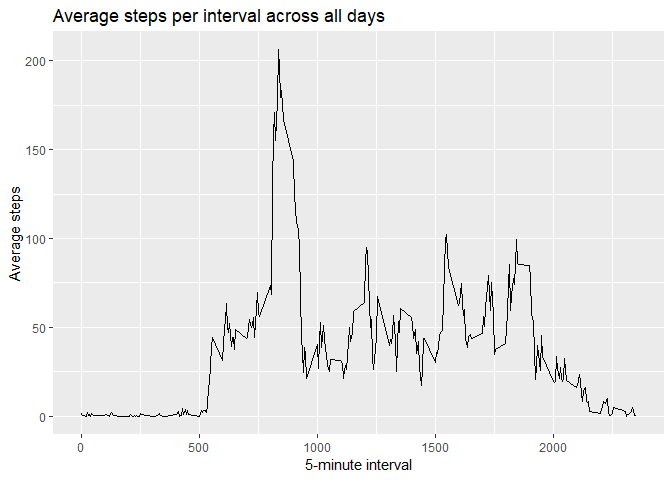
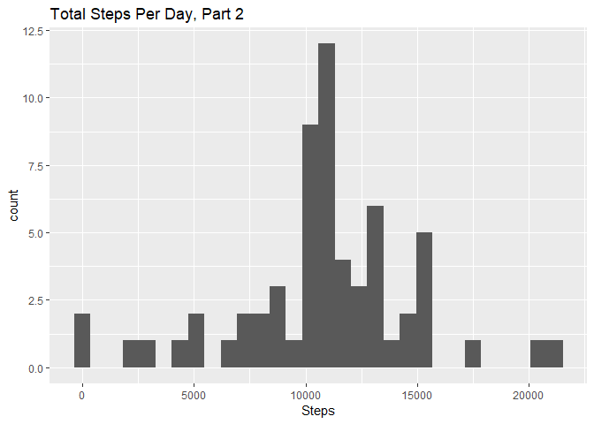
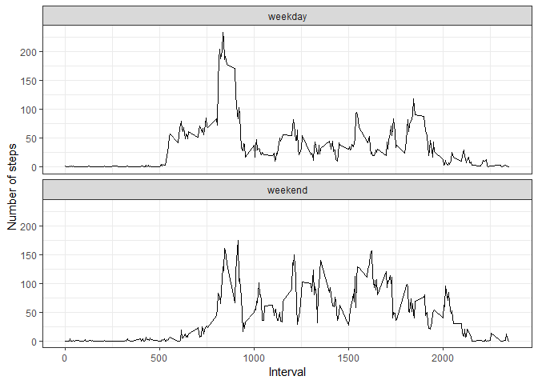

## Loading and preprocessing the data

```r
#Unzip the datafile
datafile = unzip("activity.zip")
#Load the unzipped data
activity = read.csv(datafile, header = T)
```

## What is mean total number of steps taken per day?
1. Calculate the total number of steps taken per day

```r
library(dplyr)
```

```
## Warning: package 'dplyr' was built under R version 3.5.3
```

```
## 
## Attaching package: 'dplyr'
```

```
## The following objects are masked from 'package:stats':
## 
##     filter, lag
```

```
## The following objects are masked from 'package:base':
## 
##     intersect, setdiff, setequal, union
```

```r
steps = activity %>% 
      group_by(date) %>% 
      summarise(total_steps = sum(steps, na.rm = T))
mean = steps %>% 
      summarise(mean = mean(total_steps),
                median = median(total_steps))
```

#2. Make a histogram of the total number of steps taken each day

```r
library(ggplot2)
ggplot(steps, aes(total_steps)) +geom_histogram() +xlab("Steps") +labs(title = "Total Steps Per Day")
```

```
## `stat_bin()` using `bins = 30`. Pick better value with `binwidth`.
```

<!-- -->

#3. Calculate and report the mean and median of the total number of steps taken per da

```r
steps2 = steps %>% 
      summarise(mean_steps = mean(total_steps, na.rm = TRUE),
                median_steps = median(total_steps, na.rm = TRUE))
```


## What is the average daily activity pattern?

1. Make a time series plot (i.e. type="l") of the 5-minute interval (x-axis) and the average number of steps taken, averaged across all days (y-axis)


```r
average = activity %>% 
      group_by(interval) %>% 
      summarise(mean_steps = mean(steps, na.rm = T))

ggplot(average, aes(interval,mean_steps))+geom_line()+xlab("5-minute interval")+ylab("Average steps")+
      labs(title = "Average steps per interval across all days")
```

<!-- -->

2. Which 5-minute interval, on average across all the days in the dataset, contains the maximum number of steps?

```r
average[which.max(average$mean_steps),]
```

```
## # A tibble: 1 x 2
##   interval mean_steps
##      <int>      <dbl>
## 1      835       206.
```


## Imputing missing values

1. Calculate and report the total number of missing values in the dataset (i.e. the total number of rows with NAs)

```r
missing = activity %>% 
      filter(is.na(steps)) %>% 
      summarise(N=n())
missing
```

```
##      N
## 1 2304
```

2. Devise a strategy for filling in all of the missing values in the dataset. The strategy does not need to be sophisticated. For example, you could use the mean/median for that day, or the mean for that 5-minute interval, etc.
Use the interval mean

3. Create a new dataset that is equal to the original dataset but with the missing data filled in.

```r
activity2 = left_join(activity,average) %>% 
      mutate(steps = ifelse(is.na(steps),mean_steps, steps)) %>% 
      select(-mean_steps)
```

```
## Joining, by = "interval"
```

4. Make a histogram of the total number of steps taken each day and calculate and report the mean and median total number of steps taken per day. 
Do these values differ from the estimates from the first part of the assignment? 
What is the impact of imputing missing data on the estimates of the total daily number of steps?

Yes. Both the mean and median increased by inputting the missing data when compared to the results of the first part of the assignment.


```r
new_steps = activity2 %>% 
      group_by(date) %>% 
      summarise(sum = sum(steps))
new_mean = new_steps %>% 
      summarise(mean = mean(sum),
                median = median(sum))

ggplot(new_steps, aes(sum))+ geom_histogram()+xlab("Steps") +labs(title = "Total Steps Per Day, Part 2")
```

```
## `stat_bin()` using `bins = 30`. Pick better value with `binwidth`.
```

<!-- -->

## Are there differences in activity patterns between weekdays and weekends?

For this part the weekdays() function may be of some help here. Use the dataset with the filled-in missing values for this part.

1. Create a new factor variable in the dataset with two levels – “weekday” and “weekend” indicating whether a given date is a weekday or weekend day.

```r
activity3 = activity %>% 
      mutate(date = as.Date(date),
             weekday = weekdays(date),
             weekday2 = as.factor(ifelse(weekday=="Sunday"|weekday=="Saturday","weekend","weekday")))
```

2. Make a panel plot containing a time series plot (i.e. type="l") of the 5-minute interval (x-axis) and the average number of steps taken, averaged across all weekday days or weekend days (y-axis).

```r
steps3 = activity3 %>% 
      group_by(weekday2,interval) %>% 
      summarise(mean = mean(steps, na.rm = T))

ggplot(steps3, aes(interval, mean)) + geom_line() + facet_wrap(~weekday2, nrow = 2) +ylab("Number of steps")+
      xlab("Interval") +theme_bw()
```

<!-- -->
